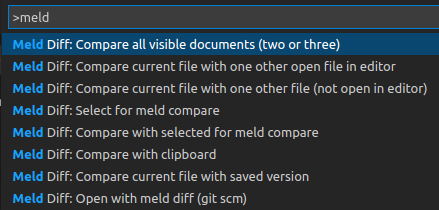
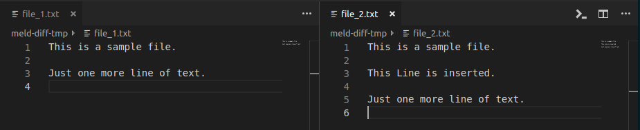
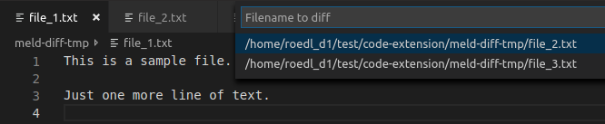
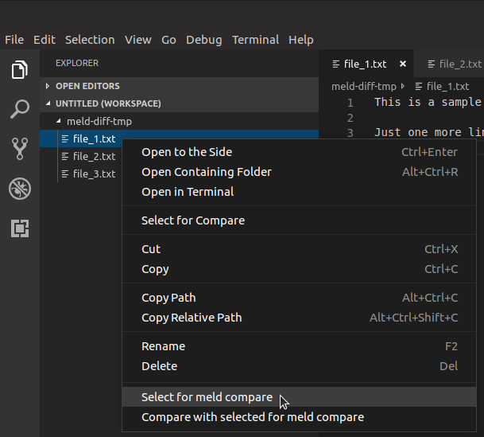
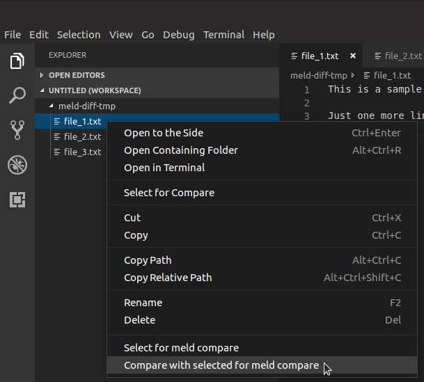
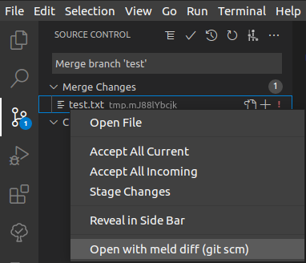
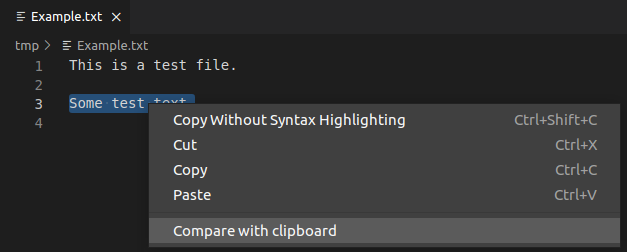
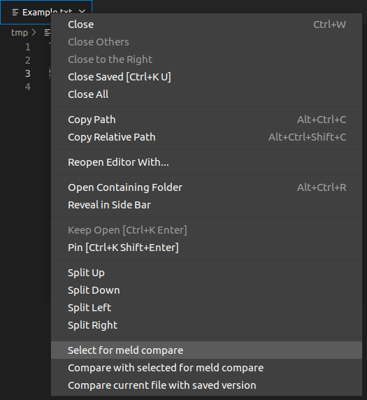
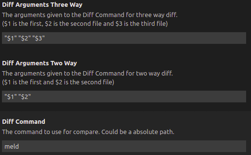

# Compare files, folders, clipboard or git changes with the tool meld (or other like WinMerge, Beyond Compare, ...) directly from vs code

This extension open two files (or folders) in the external tool meld (or any other diff tool you want). It is also possible to compare editor context or text selection with the clipboard or to use it with the git source control.

There are several commands to do different ways of comparing. It is also possible to choose the files (or folders) from the file list.

Hit `Ctrl` + `Shift` + `P` to open the command menu and type `Meld Diff`.

*Folder comparison is only possible from file list (see hint in command description 'Select for meld compare' and 'Compare with selected for meld compare')*

**Important:**
Meld tool must be available on your system. In a command line the command `meld <file1> <file2>` should work.
On Windows you maybe have to add the executable folder of meld to your PATH.
If this is not possible the command can be changed to an absolute path (see [Customize settings](#customize-settings)).

It is also possible to change the compare tool (see [Customize settings](#customize-settings)).

Table of contents:
- [Compare files, folders, clipboard or git changes with the tool meld (or other like WinMerge, Beyond Compare, ...) directly from vs code](#compare-files-folders-clipboard-or-git-changes-with-the-tool-meld-or-other-like-winmerge-beyond-compare--directly-from-vs-code)
- [Detailed command information](#detailed-command-information)
  - [Compare all visible documents (two or three) using meld](#compare-all-visible-documents-two-or-three-using-meld)
  - [Compare current file with one other open file in editor using meld](#compare-current-file-with-one-other-open-file-in-editor-using-meld)
  - [Compare current file with one other file (not open in editor) using meld](#compare-current-file-with-one-other-file-not-open-in-editor-using-meld)
  - [Compare current file with saved version using meld](#compare-current-file-with-saved-version-using-meld)
  - [Select for meld compare](#select-for-meld-compare)
  - [Compare with selected for meld compare](#compare-with-selected-for-meld-compare)
  - [Compare with clipboard using meld](#compare-with-clipboard-using-meld)
  - [Open with meld diff (git scm)](#open-with-meld-diff-git-scm)
  - [Compare all selected files/folders using meld](#compare-all-selected-filesfolders-using-meld)
- [Usage with file list (also folder comparison possible)](#usage-with-file-list-also-folder-comparison-possible)
  - [Select for meld compare](#select-for-meld-compare-1)
  - [Compare with selected for meld compare](#compare-with-selected-for-meld-compare-1)
  - [Compare all selected files/folders using meld](#compare-all-selected-filesfolders-using-meld-1)
- [Usage with editor context menu](#usage-with-editor-context-menu)
- [Usage with editor title context menu](#usage-with-editor-title-context-menu)
- [Customize settings](#customize-settings)
  - [Use other tools than meld](#use-other-tools-than-meld)
  - [Don't delete temp files if visual studio code is closed before meld](#dont-delete-temp-files-if-visual-studio-code-is-closed-before-meld)

# Detailed command information
This chapter describes every command in detail.

## Compare all visible documents (two or three) using meld
Up to three visible files can be compared with this command. To use it two or three files have to be visible side by side.

If there are more than three files visible the three files with the newest modification timestamp are used.

## Compare current file with one other open file in editor using meld
The current selected file will be the first file for the comparison (left side in meld).

The second file for the comparison (right side in meld) is selected by menu which shows all open files.

## Compare current file with one other file (not open in editor) using meld
The current selected file will be the first file for the comparison (left side in meld).

The second file file for the comparison (right side in meld) is selected by open file dialog.

## Compare current file with saved version using meld
Compare the changed version in the current editor with it's saved version.

Change the contend in an editor and call the function. The changed content will be compared with the saved content in meld.

This command is also available in the [editor title context menu](#usage-with-editor-title-context-menu).

## Select for meld compare
Set the current selected file as the first file for the comparison (left side in meld).

This command is also available in the [file list](#usage-with-file-list-also-folder-comparison-possible) (only if one element is selected) and the [editor title context menu](#usage-with-editor-title-context-menu).

## Compare with selected for meld compare
Compare the current file (right side in meld) with the file selected before by '*Select for meld compare*'.

This command is also available in the [file list](#usage-with-file-list-also-folder-comparison-possible) (only if one element is selected and an element for meld compare is selected before) and the [editor title context menu](#usage-with-editor-title-context-menu).

## Compare with clipboard using meld
Compare the current file or the current selected text with the content of the clipboard.

1. Select text in an editor
2. Start '*Compare with clipboard*' from global menu or right click menu

If no text is selected the whole content of the editor is taken as selection.

If the selection is equal to the clipboard just a message will appear and no meld is started.

If the selection is not equal meld will be started comparing the saved file with the clipboard (not the maybe unsaved content).

This command is also available in the [editor context menu](#usage-with-editor-context-menu).

## Open with meld diff (git scm)
It is possible to open a diff or merge conflict of a file from the Source Control window with meld (only for git).

Therefore the command '*Open with meld diff (git scm)*' can be selected from the context menu.

All versions of the file that are not in the current workspace that are needed for the diff (e.g for diff of HEAD version to staged version) are only temporary and are deleted after meld is closed.

## Compare all selected files/folders using meld
Compare all in file list selected files or folder using meld.

This option is only available in the file list and only if more than one file is selected.

**Command in context menu only available if multiple elements are selected in list!**

# Usage with file list (also folder comparison possible)
## Select for meld compare
Select the first file or folder to compare (left side in meld) by right click on file list and hit '*Select for meld compare*'.

**Command in context menu only shown if one element is selected!**

## Compare with selected for meld compare
Select the file or folder to compare to the file or folder selected before (right side in meld) by right click on file list and hit '*Compare with selected for meld compare*'.

**Command in context menu only if one element is selected and an element for meld compare was selected before!**

## Compare all selected files/folders using meld
See [Compare all selected files/folders using meld](#compare-all-selected-filesfolders-using-meld) above.

# Usage with editor context menu
The command '*Compare with clipboard*' is also available in the context menu of a text editor.

# Usage with editor title context menu
The commands '*Select for meld compare*', '*Compare with selected for meld compare*' and '*Compare current file with saved version*' are also available in the context menu of a text editor title.

# Customize settings
## Use other tools than meld
In the settings for Meld Diff it is possible to customize the tool to use. Instead of Meld other tools like WinMerge or Beyond Compare can be used. Also the given arguments can be configured.

The default values are:

## Don't delete temp files if visual studio code is closed before meld
By default all temporary files created for comparison of unsaved files, selections and clipboard are removed on closing visual studio code. This is done even if meld instances are running.

To prevent deleting of temp files that are used by meld instances on closing visual studio code uncheck the settings entry `Temporary files (created for clipboard or unsaved comparison) are deleted if visual studio code is closed before meld`.